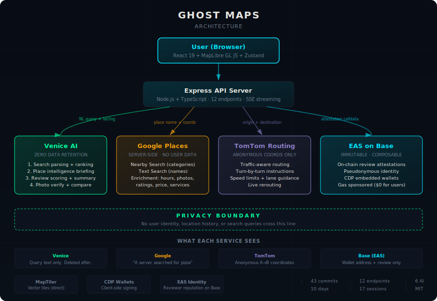

# Ghost Maps

**Private AI-powered maps with trustworthy on-chain reviews.**

Google Maps tracks your location every 2 minutes and has paid $7.3B+ in privacy fines. Ghost Maps is the alternative — AI-powered search, on-chain reviews that can't be deleted or manipulated, and real navigation, without anyone knowing where you go.

**Live at [ghostmaps.app](https://ghostmaps.app)**

### Try It

The map defaults to Loveland, CO. Search for these places to see on-chain reviews with AI quality scoring, GPS verification, and community summaries:

- **"Avery's Modern Teahouse"** — search "tea in Loveland"
- **"Slice House"** — search "pizza in Loveland"
- **"Verboten Brewing"** — search "brewing in Loveland"

Also try location-aware searches like "coffee in Denver" or "pizza in Los Angeles".

---

## What It Does

1. **Search privately** — Type "best tacos near me" and Venice AI (zero data retention) interprets your query, finds places via Google Places (server-side, no user data sent), and ranks results with explanations
2. **See real details** — Tap a place to see hours, photos, ratings, price level, and an AI-generated briefing
3. **Read trustworthy reviews** — Reviews are on-chain attestations (EAS on Base) that no business can pay to remove and no platform can filter
4. **Write verified reviews** — Sign up with email (invisible wallet created on Base), write a review with photo proof-of-visit, Venice AI scores quality, review goes on-chain — user never sees crypto
5. **Navigate privately** — Turn-by-turn directions with traffic-aware ETA, speed limits, lane guidance, and live rerouting — without storing your route

---

## Architecture



```
Browser (React + MapLibre GL JS)
  │
  ├── Venice AI ──── Natural language search parsing + ranking
  │                  Review quality scoring + summarization
  │                  Place intelligence briefings
  │                  Zero data retention
  │
  ├── Google Places ── POI search, hours, ratings, photos
  │                    (server-side, no user identity sent)
  │
  ├── TomTom ──────── Route calculation with live traffic
  │                    (anonymous origin/destination only)
  │
  ├── EAS on Base ──── On-chain review attestations
  │                     Immutable, composable, sub-cent cost
  │
  └── Coinbase CDP ─── Email OTP signup → invisible wallet
                        Gas sponsored via Paymaster ($0 for users)
```

### Privacy Model

| What Google Maps Collects | What Ghost Maps Does |
|---|---|
| Location every ~2 minutes | No location storage. Venice = zero retention |
| Every search query saved | Venice = zero data retention |
| Navigation routes + speed + stops | TomTom calculates route, we don't store it |
| Every business view, click, call | No interaction tracking |
| Reviews tied to real identity | Pseudonymous (wallet address only) |
| Cross-app profiling (YouTube, Search, Ads) | No other services, no ad network |
| 11,500+ geofence warrants/year | Nothing to hand over |
| Tracked 98M users who opted out | No opt-out needed — data never exists |

**Transparency:** We disclose exactly what each service sees:

- **TomTom** sees anonymous origin/destination coordinates for route calculation. No user identity.
- **Google Places** sees search queries and location coordinates (needed to find nearby places) — but all requests come from our server, so Google never sees *who* is searching. Google sees "a server searched for pizza near 40.15, -105.10" — not "Jeremy searched for pizza." No user identity, session, or device info is sent.
- **MapTiler** serves map tiles directly to the browser. Tile requests reveal approximate area (city/neighborhood level, not precise location) via standard HTTP. This is the same as loading any map — no more identifying than browsing a weather site. No user identity is sent.
- **Coinbase CDP** handles wallet creation via email OTP. Coinbase holds the email-to-wallet mapping — but we don't store emails ourselves, and email-based auth is standard across every app. The alternative (asking users to manage seed phrases) would make the app unusable. CDP is a bridge to invisible crypto UX, not a surveillance vector.
- **Server logs** contain only errors and startup messages. No search queries, locations, or user data are logged.

---

## Tech Stack

| Layer | Technology |
|---|---|
| Frontend | React 19 + Vite + Tailwind CSS v4 + MapLibre GL JS |
| Map Tiles | MapTiler Streets v2 (vector tiles, 100K/month free) |
| State | Zustand (client state) + TanStack Query (server state) |
| Backend | Node.js + Express 5 + TypeScript (tsx) |
| AI | Venice API (OpenAI-compatible, zero data retention) |
| POI Data | Google Places API (search + enrichment, server-side, no user data sent) |
| Navigation | TomTom Routing API (traffic, speed limits, lane guidance) |
| On-Chain | EAS on Base via ethers.js + EAS SDK |
| Guardian Agent | MiniMax M2.7 via Venice API (autonomous review verification) |
| Agent Identity | ERC-8004 Identity Registry on Base |
| Token | GHOST ERC-20 on Base Sepolia (review rewards) |
| Auth | Coinbase CDP Embedded Wallets (email OTP, invisible wallet) |
| Streaming | Server-Sent Events (SSE) |
| Testing | Vitest (unit + integration) + Playwright (E2E) |
| Deployment | Railway (single service) |

---

## Venice AI Integration (6 Endpoints)

Venice is central to the app, not a utility:

1. **Conversational search** — Parse natural language queries ("late night tacos with outdoor seating"), extract intent (categories, attributes, radius), rank results with explanations
2. **Place intelligence briefing** — Synthesize all POI data into a 2-3 sentence natural language summary per place
3. **Review quality scoring** — Analyze specificity, sentiment-rating consistency, flag suspicious patterns (1-100 score)
4. **Review summarization** — Aggregate all on-chain reviews for a place into a community briefing
5. **Photo verification** — Metadata analysis (file size, GPS, dimensions) to support proof-of-visit
6. **Comparative recommendations** — Compare 2-5 places using reviews + data, explain tradeoffs

---

## On-Chain Reviews (EAS on Base)

Reviews are Ethereum Attestation Service attestations — immutable, composable, and verifiable.

**Schema:** `uint8 rating, string text, string placeId, string placeName, bytes32 photoHash, int256 lat, int256 lng, uint8 qualityScore`

**Schema UID:** `0x968e91f0274b78a31037839b55e59b942dd1521daebf9190268137e450b7d69f`

**Why on-chain reviews matter:**
- Businesses can't pay to remove negative reviews (unlike Yelp — 700+ lawsuits alleging pay-to-play)
- Platforms can't filter reviews to favor advertisers
- Reviews are composable — any app can read and build on them
- Quality scoring by Venice AI creates a trust signal without centralized moderation
- Gas is sponsored via CDP Paymaster — users pay $0

**Review quality tiers:** Generic (0-25) → Decent (26-50) → Detailed (51-75) → Exceptional (76-100)

### Immutability Tradeoffs

Immutable reviews solve real problems (Yelp pay-to-play, platform censorship), but they create new ones. We've thought about this:

**What about fake or harmful reviews?** Current defenses (hackathon MVP):
- **Venice AI content moderation** — reviews are scored and checked for threats, hate speech, adult content, doxxing, spam, and sentiment-rating mismatches. 7 blocking flags prevent harmful content from reaching the chain.
- **Server-side pre-check** — pattern matching catches obvious threats and spam that LLMs may miss (death threats, URLs, all-caps spam)
- **Minimum quality threshold** — reviews must be at least 25 characters
- **Fail closed** — if Venice scoring fails, the review is rejected (not defaulted to "acceptable")
- **EXIF GPS proof-of-visit** — optional photo verification confirms the reviewer was physically at the location
- **Account age and review count** — credibility signals displayed on each review

**What about harassment or defamatory content?** Reviews with threats, hate speech, adult content, or doxxing are blocked *before* they reach the chain — they never become attestations. For edge cases that pass automated checks, the client can filter reviews below a quality threshold. Planned for v2: community counter-attestations (on-chain flags that reference a review's UID, enabling decentralized moderation).

**What about sybil attacks (mass fake accounts)?** The **Review Guardian agent** solves this. See below.

**Our position:** Centralized moderation is a solved problem — and it's been solved badly (Yelp extortion, Google's 240M removed fakes in 2024). We'd rather build robust decentralized quality signals than recreate the system we're replacing.

---

## Review Guardian Agent

An autonomous AI agent that monitors the Base blockchain for new Ghost Maps review attestations, investigates patterns, and publishes transparent verification verdicts on-chain.

**The agent IS the LLM.** It reasons natively about review patterns — no hardcoded rules. Given guidelines (not checklists), it decides what to investigate, how deep to go, and what action to take. Every situation is different, and the agent's response is different.

### How It Works

1. Agent polls EAS every 4 hours for new review attestations (or runs on-demand with `--once`)
2. Agent reasons about patterns: wallet ages, timing, rating distributions, content similarity
3. Agent uses tools to investigate: query wallet history, query place reviews, cross-reference
4. Agent publishes verification attestations on-chain with verdict, confidence, and reasoning

**Verdicts:** `legitimate` | `suspicious` | `sybil` | `spam`

**Verification Schema:** `string verdict, uint8 confidence, string reasoningSummary`

**Schema UID:** [`0x351ed5d597414cc66a0835da8614ac4d37af6213dc4deeee898912695a9bd635`](https://base-sepolia.easscan.org/schema/view/0x351ed5d597414cc66a0835da8614ac4d37af6213dc4deeee898912695a9bd635)

Each verification attestation uses EAS `refUID` to reference the original review — native EAS composability. Anyone can read the verdicts, audit the reasoning, or deploy their own auditor agent against the same schema.

### On-Chain Identity (ERC-8004)

The Guardian is registered on the [ERC-8004 Identity Registry](https://www.8004.org) (`0x8004A169...`) on Base Sepolia. This gives it a verifiable on-chain identity (agentId NFT) and discoverable metadata about its capabilities and verification schema.

**Guardian wallet:** [`0x2efeEd3097978664731ffe6EC0FaFa5CFD58b08D`](https://sepolia.basescan.org/address/0x2efeEd3097978664731ffe6EC0FaFa5CFD58b08D)

### GHOST Token Rewards

**GHOST token:** [`0x98d2ccd1d02F396A4a6FDE996381297c655BB198`](https://sepolia.basescan.org/address/0x98d2ccd1d02F396A4a6FDE996381297c655BB198) (ERC-20 on Base Sepolia)

Verified reviews earn GHOST tokens on a **quadratic reward curve** — higher quality reviews earn exponentially more:

| Quality Score | GHOST Reward |
|---|---|
| 100 (Exceptional) | 100 GHOST |
| 75 (Detailed) | 56.25 GHOST |
| 50 (Decent) | 25 GHOST |
| 25 (Generic) | 6.25 GHOST |
| 10 (Minimal) | 1 GHOST |

Formula: `GHOST = (quality²) / 100`

The reward flow is fully on-chain and trustless:

1. Reviewer submits review → on-chain attestation with quality score
2. Guardian verifies review → on-chain verification attestation
3. If verdict is `legitimate` with confidence ≥ 60% → GHOST tokens released to reviewer based on quality

**Why this matters:** Every previous token-incentivized review system failed because paying for reviews creates an incentive to fake them, and no one solved the filtering problem. The Guardian agent solves this — token rewards become viable because fraud is caught before rewards are distributed. The quadratic curve further incentivizes quality: a detailed review (quality 75) earns 9x more than a generic one (quality 25).

### Architecture

```
agent/
├── guardian.ts              # Agent core — LLM loop with tool use
├── guidelines.ts            # Agent mandate and investigation principles
├── tools.ts                 # EAS query + publish tools for the LLM
├── schema.ts                # ReviewVerification schema definition
├── test-harness.ts          # Generate test scenarios (sybil, spam, organic, legitimate)
├── register-8004.ts         # ERC-8004 identity registration
├── deploy-schema.ts         # Deploy verification schema on Base Sepolia
├── deploy-token.ts          # Deploy GHOST ERC-20 token
├── generate-wallet.ts       # Generate dedicated agent wallet
└── contracts/
    ├── GhostToken.ts        # GHOST ERC-20 (pre-compiled bytecode)
    └── RewardDistributor.ts # Token reward distribution logic
```

---

## API Reference

Base URL: `https://ghostmaps.app/api` (production) or `http://localhost:3001/api` (development)

Full API documentation with request/response schemas: [`API.md`](API.md)

### Endpoints Summary

| Method | Endpoint | Description |
|---|---|---|
| `GET` | `/api/search?q=&lat=&lng=` | Basic search via Google Places |
| `GET` | `/api/ai-search?q=&lat=&lng=` | AI-powered search (non-streaming) |
| `GET` | `/api/ai-search/stream?q=&lat=&lng=` | AI-powered search with SSE streaming |
| `GET` | `/api/places/:id` | Place details with Google Places enrichment |
| `GET` | `/api/places/:id/briefing` | Venice AI place intelligence briefing |
| `POST` | `/api/reviews/score` | Score review quality via Venice AI |
| `GET` | `/api/reviews/:placeId` | Fetch on-chain reviews + identities + AI summary |
| `POST` | `/api/photos` | Upload review photo (returns SHA-256 hash) |
| `GET` | `/api/photos/:hash` | Serve review photo by hash |
| `POST` | `/api/route` | Calculate route via TomTom (traffic-aware) |
| `POST` | `/api/compare` | Compare 2-5 places via Venice AI |
| `GET` | `/api/server-ip` | Server outbound IP (for API key whitelisting) |

---

## Project Structure

```
ghostmaps/
├── client/                     # React frontend
│   └── src/
│       ├── components/         # UI components (Map, SearchBar, PlacePanel, NavigationPanel, etc.)
│       ├── hooks/              # Custom hooks (useAISearch, usePlaceDetails, useNavigationTracking, etc.)
│       ├── lib/                # Utilities (CDP wallet, EAS SDK, geo math, nav helpers)
│       └── assets/
├── server/                     # Express API backend
│   ├── index.ts                # Route definitions
│   ├── venice.ts               # Venice AI (parse, rank, briefing, score, summarize, compare)
│   ├── search.ts               # Distance calculations + coordinate parsing
│   ├── google-places.ts        # Google Places search + enrichment + geocoding
│   ├── tomtom.ts               # TomTom routing
│   ├── eas-reader.ts           # EAS on-chain review fetching
│   ├── photos.ts               # Photo upload/storage (SHA-256 keyed)
│   └── types.ts                # TypeScript type definitions
├── e2e/                        # Playwright E2E tests
├── plans/                      # Architecture docs, research, build plan
├── API.md                      # Full API documentation
└── CLAUDE.md                   # Development guidelines
```

---

## Development

### Prerequisites

- Node.js 20+
- API keys: Venice, MapTiler, Google Places, TomTom, Coinbase CDP

### Setup

```bash
git clone https://github.com/jeremylanger/ghostmaps.git
cd ghostmaps

# Create .env with required keys
cp .env.example .env

# Install dependencies
npm install
cd client && npm install --legacy-peer-deps && cd ..
cd server && npm install && cd ..
```

### Environment Variables

```env
# Required
VENICE_API_KEY=           # Venice AI (zero data retention)
VITE_MAPTILER_KEY=        # MapTiler Streets v2 tiles
GOOGLE_PLACES_API_KEY=    # Place enrichment (hours, ratings, photos)
TOMTOM_API_KEY=           # Route calculation
VITE_CDP_PROJECT_ID=      # Coinbase CDP embedded wallets

# Guardian agent (in agent/.env)
GUARDIAN_PRIVATE_KEY=     # Guardian wallet private key
VENICE_API_KEY=           # Venice API key (for Guardian LLM)
GHOST_TOKEN_ADDRESS=      # Deployed GHOST ERC-20 address

# Optional
PORT=3001                 # Server port (default: 3001)
```

### Run Locally

```bash
# Terminal 1 — Backend
cd server && npm run dev          # Express on :3001 (tsx watch)

# Terminal 2 — Frontend
cd client && npx vite --port 5174 # Vite on :5174, proxies /api to :3001
```

### Run Tests

```bash
# Server tests
cd server && npm test                    # All (unit + integration)
cd server && npm run test:unit           # Unit only
cd server && npm run test:integration    # Integration only

# E2E tests (requires both servers running)
npx playwright test --config e2e/playwright.config.ts
```

---

## Deployment

Deployed on **Railway** as a single service (Express serves API + Vite static build).

```bash
# Deploy
railway up

# Check logs
railway logs --lines 20

# Set environment variables
railway vars set KEY=value
```

DNS: Porkbun (ALIAS record → Railway edge). SSL auto-provisioned by Railway.

---

## Hackathon

Built for **The Synthesis** (March 13-22, 2026) — a 10-day hackathon judged by AI agents + humans.

**Track:** Venice Bounty — "Private Agents, Trusted Actions"

**Scoring criteria:** Confidentiality as design requirement, agent architecture and trust design, problem legitimacy, scope and demo quality.

---

## License

MIT
